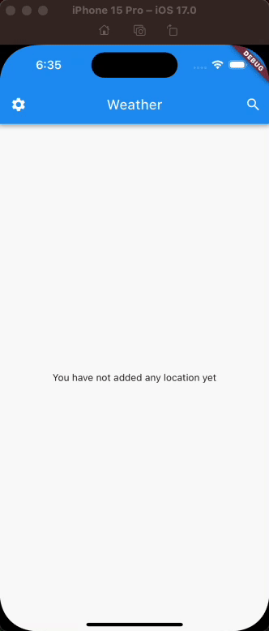

# Weather app
Create a basic Flutter mobile app that fetches and displays current weather information for a given location

### Preview

### Requirements
1. Location Input: Users should be able to input a location (e.g., city name or zip code).
2. Weather Display: Upon entering a location, the app should fetch and display the current weather information, including:
- Temperature (in Celsius or Fahrenheit)
- Weather condition (e.g., sunny, cloudy, rainy)
3. Error Handling: Implement basic error handling for cases where the location input is invalid or the weather data cannot be retrieved.
4. User-Friendly UI: Design a simple and user-friendly UI.

### Achivements
- [x] Using bloc architecture
- [x] Using 3rd party SDWebImage to load remote images
- [x] Location input: Users can input a location
- [x] Weather display temperature and weather condition
- [x] Users can choose what unit of temperature they want to display
- [x] Error Handling: Handles some common errors
- [ ] User-Friendly UI
- [x] Config PROD and DEV
- [ ] Supports dark mode 
- [ ] Supports localization
- [ ] Unit test
- [ ] Integration test

------
## Setup environment
Below is information about fultter and the environment details I am using:
- [x] Flutter (Channel stable, 3.13.0, on macOS 13.5 22G74 darwin-arm64, locale en-VN)
- [x] Android toolchain - develop for Android devices (Android SDK version 32.1.0-rc1)
- [x] Xcode - develop for iOS and macOS (Xcode 15.0)
- [x] Chrome - develop for the web
- [x] Android Studio (version 2021.3)
- [x] VS Code (version 1.85.1)

## Run
- Using vscode, open project folder
- From the terminal, run `flutter run`. Default the environment will be DEV
- In case you want to run PROD, please use `flutter run --dart-define ENV=PROD`. But, at this time, the configuration for PROD and DEV is the same.
Note: I usually use vscode for work, however, in case of Android Studio, things may be different.

## Build app
- Build dev: 
  - Android: `flutter build apk --dart-define ENV=DEV`
  - iOS: `flutter build ipa --dart-define ENV=DEV`
- Build prod: 
  - Android: `flutter build appbundle --dart-define ENV=PROD`
  - iOS: `flutter build ipa --dart-define ENV=PROD`

## Generate Assets (SVG's paths, image's paths, font's paths):
- If you installed fluttergen before: `fluttergen`
- Otherwise: `flutter pub run build_runner build`

## Generate Code:
- From the terminal, run: `flutter pub run build_runner build`
